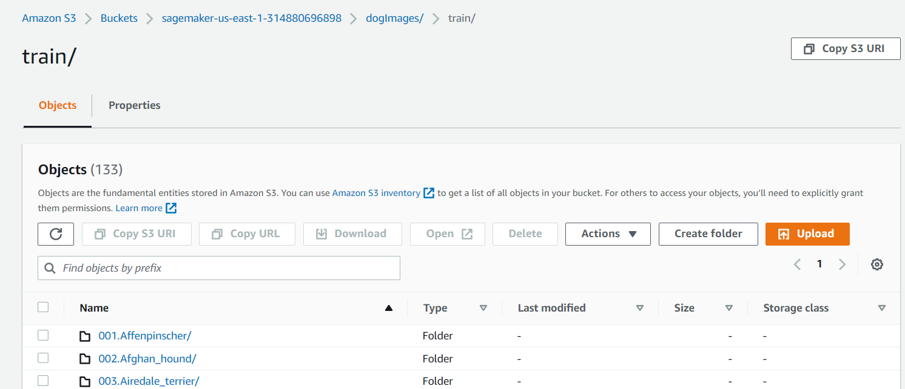
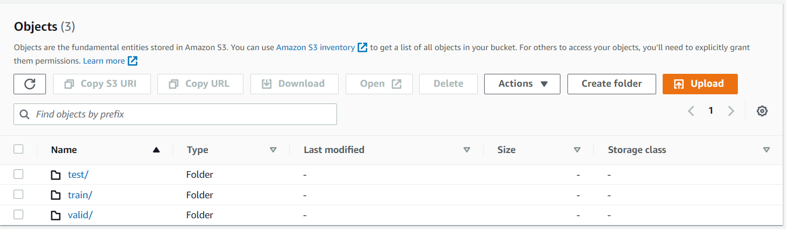

# Image Classification using AWS SageMaker

Use AWS Sagemaker to train a pretrained model that can perform image classification by using the Sagemaker profiling, debugger, hyperparameter tuning and other good ML engineering practices. This can be done on either the provided dog breed classication data set or one of your choice.

## Project Set Up and Installation
Enter AWS through the gateway in the course and open SageMaker Studio. 
Download the starter files.
Download/Make the dataset available. 

## Dataset
The provided dataset is the dogbreed classification dataset which can be found in this link https://s3-us-west-1.amazonaws.com/udacity-aind/dog-project/dogImages.zip.


### Access
Upload the data to an S3 bucket through the AWS so that SageMaker has access to the data using the following command
```
!wget https://s3-us-west-1.amazonaws.com/udacity-aind/dog-project/dogImages.zip
!unzip dogImages.zip 
os.environ["DEFAULT_S3_BUCKET"] = bucket
!aws s3 sync ./dogImages s3://${DEFAULT_S3_BUCKET}/dogImages --quiet
```



## Hyperparameter Tuning
What kind of model did you choose for this experiment and why? Give an overview of the types of parameters and their ranges used for the hyperparameter search


i used **resnet50** pretrained model as an intial model to start training. i tuned couple of hyperparameters like 
* learn rate
* batch size
* epochs

i created 4 training job and found out that the best model has the following hyperparameter values
* learn-rate = 0.04236217957338397
* batch-size = 64
* epochs = 10

Remember that your README should:
- Include a screenshot of completed training jobs
- Logs metrics during the training process
- Tune at least two hyperparameters
- Retrieve the best best hyperparameters from all your training jobs

## Debugging and Profiling
in this project, i added a couple of profiling and debugging rule so i can track the progress of the model and used resources.<br>
debugger provided detect the following:
- vanishing gradient
- overfitting
- overtraining
- poor weights initialization
- if there is no change in loss

profilers to detect:
- GPU utilization

### Results
What are the results/insights did you get by profiling/debugging your model?
according to the profiling and debugging, the model has poor intial weights. the model was suffering from overfitting but the debugger didn't detect that and it was obivious because the train accuracy exceed 90% while valid accuracy was less than 80%. 

## Model Deployment
Give an overview of the deployed model and instructions on how to query the endpoint with a sample input.

the model works with jpeg images. so image must be convert before inference. the code of deployment is in python file called `deploy.py`


